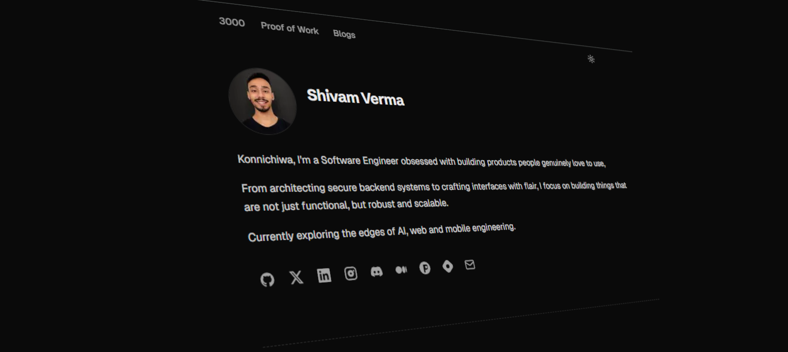

<div align="center">
  
  <h1 align="center">Shivam Verma</h1>
  
  <p align="center">
    A minimalist, ultra-fast, and highly interactive developer portfolio & technical blog built for the modern web.
    <br />
    <a href="https://theadroitdev.com"><strong>Explore the live site »</strong></a>
    <br />
    <br />
    <a href="https://github.com/TheAdroitDev/Portfolio/issues">Report Bug</a>
    ·
    <a href="https://x.com/theadroitdev">Twitter / X</a>
  </p>
</div>

<div align="center">


</div>

<br />

> **Note**: This portfolio is built using Next.js 16 (App Router), React 19, and Tailwind CSS v4. It focuses on beautiful typography (Geist font), dark mode aesthetics, and buttery-smooth micro-interactions.

## ✨ Core Features

* **🎨 Stunning UI & Animations:** Built with Framer Motion and MagicUI. Features include Sparkles, Confetti bursts, animated shiny text, and a sleek bottom progressive blur.
* **🚀 Proof of Work Showcase:** Expandable, fluid project cards containing deep technical breakdowns and real-time GitHub Star counter badges fetched directly from the GitHub API.
* **📝 Native Static Blog:** Fully integrated markdown engineering blog. Includes custom syntax highlighting, automatic H2/H3 table of contents linking, and dynamic scroll progress pill tracking.
* **📊 GitHub Contributions:** A custom, live interactive heatmap displaying recent GitHub contributions directly on the homepage.
* **🌓 Theme Toggling:** Seamless Light/Dark mode transitions powered by `next-themes`.
* **⚡ Blazing Fast:** Leverages Next.js Server Components, Turbopack, and Static Site Generation (SSG) for instant load times.

## 📦 Project Architecture

A quick look at the top-level files and directories you'll see in a Next.js project.

```text
my-portfolio/
├── src/
│   ├── app/                # Next.js 16 App Router (Pages, Layouts, Globals)
│   ├── components/         # Reusable React components (UI, Hero, Footer, etc.)
│   ├── data/               # Data stores (projects.ts, blogs.ts)
│   ├── hooks/              # Custom React hooks
│   └── lib/                # Utility functions and API configs
├── public/                 # Static assets (images, icons, fonts)
├── tailwind.config.ts      # Tailwind CSS configuration
├── next.config.ts          # Next.js configuration
└── package.json            # Project dependencies and scripts
```

## 🚀 Getting Started

To get a local copy up and running, follow these simple steps.

### Prerequisites

Ensure you have **Node.js 18+** and **pnpm** installed on your machine.

### Installation

1. **Clone the repo**
   ```sh
   git clone https://github.com/TheAdroitDev/Portfolio.git
   cd Portfolio/my-portfolio
   ```

2. **Install dependencies**
   ```sh
   pnpm install
   ```

3. **Start the development server**
   ```sh
   pnpm dev
   ```

4. **Open your browser**
   Navigate to `http://localhost:3000` to view the site.

## 🛠️ Built With

* [Next.js](https://nextjs.org/) - React Framework
* [React](https://react.dev/) - UI Library
* [Tailwind CSS](https://tailwindcss.com/) - Utility-first CSS Framework
* [Framer Motion](https://www.framer.com/motion/) - Animation Library
* [shadcn/ui](https://ui.shadcn.com/) - Reusable Component System
* [MagicUI](https://magicui.design/) - Animated Components Library

## 🤝 Contact

**Shivam Verma** - Software Engineer

* **Twitter**: [@theadroitdev](https://x.com/theadroitdev)
* **GitHub**: [@TheAdroitDev](https://github.com/TheAdroitDev)
* **Website**: [theadroitdev.com](https://theadroitdev.com)

---

<p align="center">Developed with ❤️ by Shivam Verma</p>
